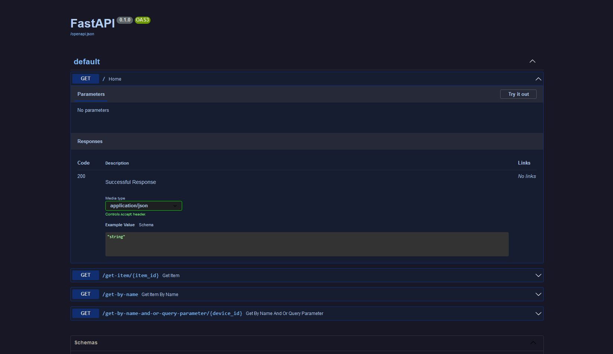

# FAST API Examples


Repo for learning FastAPI and storing examples

## Fast API Basics

    1. Import fastapi
    2. Create an instance of the FastAPI class
    3. Write a path operation decorator (like @app.get("/"))
    4. Write a path operation function (like def root(): ... below the decorator)
    5. Run the development server (like uvicorn pythonfile:classinstance --reload)

## Setup

```Bash
git clone https://github.com/DavidTWynn/fast_api_examples
cd fast_api_examples
python -m venv venv
venv\Scripts\activate
python -m pip install -r requirements.txt
```

## Run

```Bash
uvicorn tech_with_tim_example:app --reload
```

Go to http://127.0.0.1:8000
Swagger docs at http://127.0.0.1:8000/docs

### Output



## Resources

Tech with Tim video - https://www.youtube.com/watch?v=-ykeT6kk4bk

FastAPI Docs and tutorial user guide - https://fastapi.tiangolo.com/

### CSS

CSS Base template - https://github.com/Itz-fork/Fastapi-Swagger-UI-Dark/tree/main/assets

CSS Dark Mode changes - Pulled from DarkReader extension CSS Export
